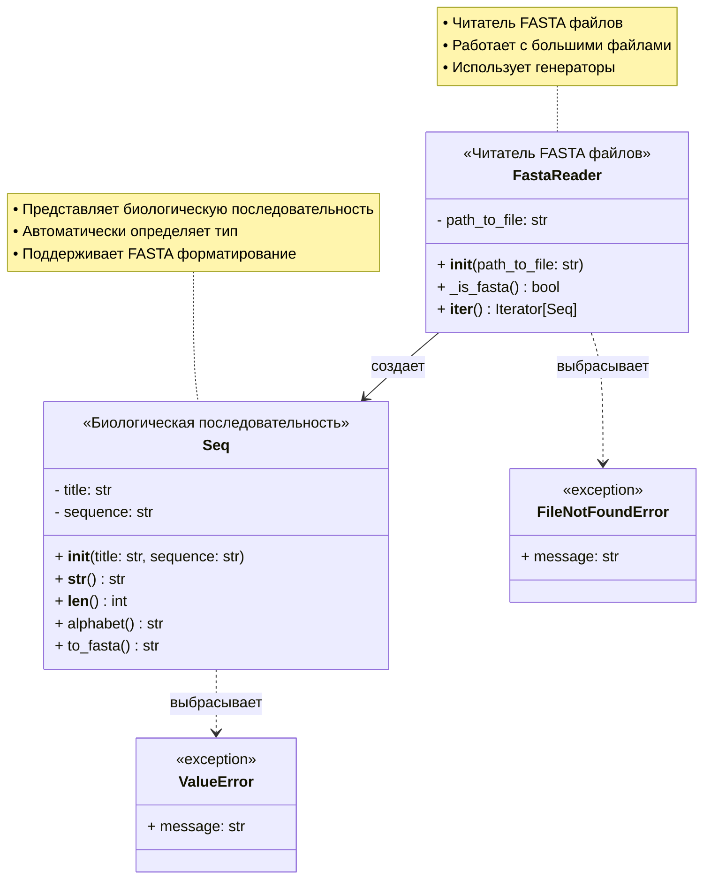

# Fasta-project

Библиотека для работы с FASTA файлами на Python.

## Описание

Проект реализует два основных класса для работы с биологическими последовательностями в формате FASTA:

- **`Seq`** - представляет отдельную последовательность
- **`FastaReader`** - читает FASTA файлы с поддержкой больших файлов через генераторы

## Возможности
**Класс Seq:** 
- Представление биологических последовательностей
- Хранение заголовка и последовательности
- Автоматическое определение алфавита (нуклеотидный/белковый)
- Вывод в формате FASTA

**Класс FastaReader:** 
- Эффективная обработка FASTA файлов
- Определение соответствия файла формату FASTA
- Чтение через генераторы для больших файлов
- Возвращение отдельных экземпляров класса Seq

## Установка

```bash

# Клонирование репозитория
git clone https://github.com/Lubov-Kost/fasta-project.git
cd fasta-project
```

## Быстрый старт
```python
from fasta import Seq, FastaReader

# Создание последовательности
seq = Seq("test_sequence", "ATCGATCG")
print(seq)  # Seq('test_sequence', 8, nucleotide)

# Чтение FASTA файла
reader = FastaReader("small_example.fasta")
for sequence in reader:
    print(f"{sequence.title}: {len(sequence)} bp")
```

## Пример вывода
```text
Seq('test_sequence', 8, nucleotide)
LRGB01001361.1 Daphnia magna strain Xinb3 scaffold01361, whole genome shotgun sequence: 2485280 bp
VFQL01000001.1 Micrococcus luteus strain M36 NODE_1_length_205052_cov_177.566207, whole genome shotgun sequence: 205052 bp
CP031746.1 Auritidibacter sp. NML130574 chromosome, complete genome: 2656163 bp
AP023247.1 Mesorhizobium sp. 131-2-1 DNA, complete genome: 6822576 bp
```

## Использование

### Класс Seq
```python
from fasta import Seq

seq = Seq("my_sequence", "ATCGATCG")
print(len(seq))      # Длина: 8
print(seq.alphabet()) # Тип: nucleotide
print(seq.to_fasta()) # FASTA формат
```
**Пример вывода**
```text
8
nucleotide
>my_sequence
ATCGATCG
```

### Класс FastaReader
```python
from fasta import FastaReader

reader = FastaReader("small_example.fasta")
for seq in reader:
    print(f"Заголовок: {seq.title}")
    print(f"Длина: {len(seq)}")
    print(f"Тип: {seq.alphabet()}")
```

**Пример вывода**
```text
Заголовок: sp|Q03692|COAA1_HUMAN Collagen alpha-1(X) chain OS=Homo sapiens OX=9606 GN=COL10A1 PE=1 SV=2
Длина: 680
Тип: protein
Заголовок: M36640.1 Human beta hemoglobin gene Azerbaidzhan beta-thalassemia mutant
Длина: 700
Тип: nucleotide
Заголовок: sp|Q13569|TDG_HUMAN G/T mismatch-specific thymine DNA glycosylase OS=Homo sapiens OX=9606 GN=TDG PE=1 SV=2
Длина: 410
Тип: protein
```

## Документация
HTML документация находится в `docs/build/html/index.html`

Чтобы пересобрать документацию:
```bash
cd docs
sphinx-build -b html source build
```

## Демонстрация
Запустите демонстрационную программу:

```bash
python demo.py
```

## Структура проекта
```text
fasta-project/
├── fasta/              # Исходный код
│   ├── __init__.py
│   ├── seq.py
│   └── fasta_reader.py
├── docs/               # Документация
│   ├── source/
│   └── build/html/
├── examples/           # Примеры FASTA файлов
├── demo.py            # Демонстрация
└── README.md          # Этот файл
```


## Лицензия
Этот проект распространяется под лицензией MIT. См. файл `LICENSE` для подробностей.
